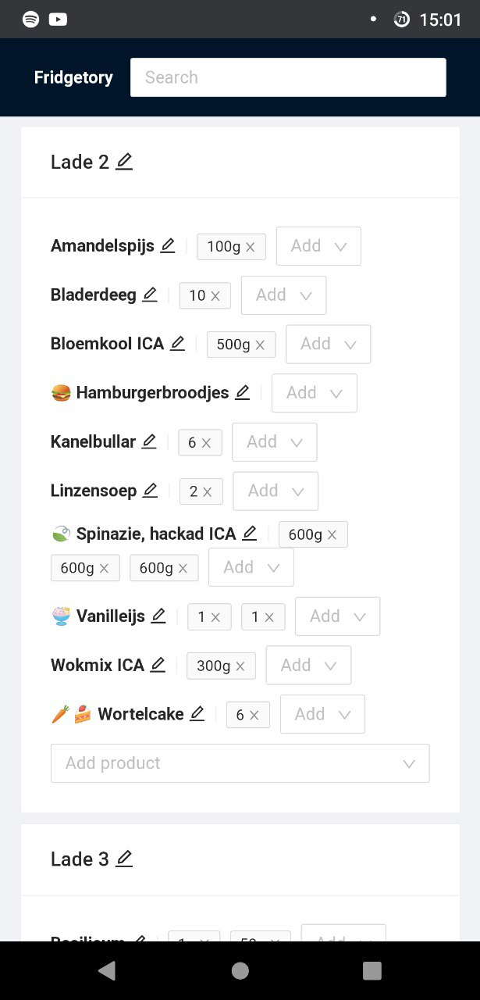

<!-- PROJECT LOGO -->
<br />
<h3 align="center">Fridgetory</h3>

<p align="center">
  <a href="https://github.com/Addono/Fridgetory">
    
  </a>

  <p align="center">
    A small web-app to track the things in your freezer!
  <br/>
  
  <a href="https://github.com/Addono/Fridgetory/graphs/contributors">
  
  </a>
  <a href="https://github.com/Addono/Fridgetory/network/members">
  
  </a>
  <a href="https://github.com/Addono/Fridgetory/stargazers">
  
  </a>
  <a href="https://github.com/Addono/Fridgetory/issues">
  
  </a>
  <a href="https://github.com/Addono/Fridgetory/blob/master/LICENSE.txt">
  
  </a> 
  <a href="https://gitpod.io/#https://github.com/Addono/Fridgetory">
  
  </a> 
  <a href="https://github.com/Addono/Fridgetory/actions">
  
  </a> 
  <br/><a href="https://github.com/Addono/Fridgetory"><strong>Explore the docs »</strong></a>
    <br />
    <a href="https://fridgetory.now.sh/">View Demo</a>
    ·
    <a href="https://github.com/Addono/Fridgetory/issues">Report a Bug</a>
    ·
    <a href="https://github.com/Addono/Fridgetory/issues">Request a Feature</a>
  </p>
</p>


## Demo

You can find a demo-deployment [here](https://fridgetory.now.sh). It's deployed to [Vercel](https://vercel.com) and a Postgres database provided by [AlwaysData](https://alwaysdata.com).

_Note: This demo deployment uses a free-tier database with a limited amount of connections (10), the serverless nature of Vercel might exhaust this limit when deploying frequently or with a surge of users. For production deployments it is recommended to use a different pool of connections for production and preview deployments and support more database connections._

## Getting Started

### Gitpod

You can use Gitpod for launching a development environment in your browser with just a single click. Go on, try it!

[](https://gitpod.io/#https://github.com/Addono/Fridgetory)

### Local

Install dependencies:

```bash
yarn
```

Prepare environment variables, the defaults should work fine if you are going to use Docker Compose in the next step.

```bash
cp prisma/.env.template prisma/.env
```

Start a Postges database:

```bash
docker-compose up -d
```

Run database migrations and generate the client:

```bash
yarn prisma:migrate && yarn prisma:generate
```

Then to run the development server in a different shell:

```bash
yarn dev
```

Open [http://localhost:3000](http://localhost:3000) with your browser to see the result.

## Deployment

### Heroku

We support one-click deployments using Heroku. Go on, try it!

[](https://heroku.com/deploy?template=https://github.com/Addono/Fridgetory/tree/main)

### Locally

Install dependencies:

```bash
yarn install --frozen-lockfile
```

Build the application:

```bash
yarn build
```

Migrate database if there are still pending migrations:
```bash
yarn prisma:migrate
```

Start the application, you can use the `PORT` environment variable to expose the application on a different port:

```bash
yarn start
```
